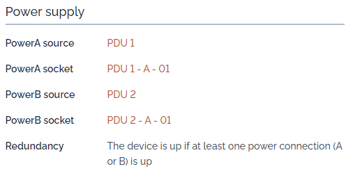
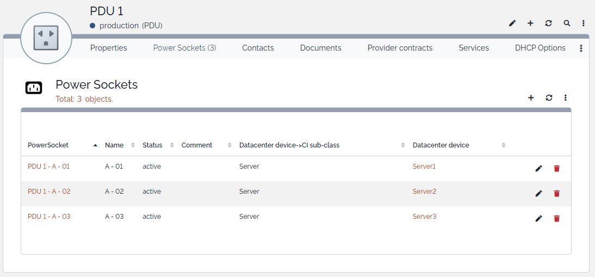

# iTop-br-powersocket

Copyright (c) 2021-2026 Björn Rudner
[](https://github.com/rudnerbjoern/iTop-br-powersocket/blob/main/LICENSE)

## Overview

This extension adds the concept of individual power sockets to PDUs in iTop and allows Datacenter Devices to be connected to specific PDU sockets.

It introduces a new class ```PowerSocket``` and provides automatic synchronization logic between:

* ```PowerSocket```
* ```PDU```
* ```DatacenterDevice```

Each ```DatacenterDevice``` can be connected to:

* one Power A socket
* one Power B socket

The extension ensures that:

* no more than two sockets are assigned to a single DatacenterDevice
* slots are automatically assigned (A first, then B)
* connections stay consistent when objects are updated or deleted
* invalid assignments are rejected or rolled back

## Features

* Adds a new ```PowerSocket``` class
* Extends the ```PDU``` model with a socket list
* Automatic batch creation of power sockets for PDUs
* Adds Power A / Power B socket fields to ```DatacenterDevice```
* Automatic slot assignment (A → B)
* Consistency checks and rollback logic
* Fully event-driven (BeforeWrite / AfterWrite / CheckToWrite / Delete)
* PHP 8.2+ compatible (no dynamic properties)
* Multilingual-ready (Dict-based messages)

### Power Supply



### PDU



## Conceptual Model

### PowerSocket

A ```PowerSocket``` represents a physical outlet on a PDU.

Each socket:

* belongs to exactly one PDU
* may be connected to exactly one DatacenterDevice
* is assigned to either slot A or B on the device

### DatacenterDevice

Each DatacenterDevice can have:

* one Power A socket
* one Power B socket

Slot assignment is automatic and enforced by consistency checks.

## How to Use

This section explains how to use the ```PowerSocket``` extension in daily operations.

### 1. Creating PowerSockets

PowerSockets represent physical outlets on a PDU.

1. Open the PDU object in iTop.
2. Scroll to the PowerSockets list.
3. Add one or more PowerSockets.
4. Give each socket a meaningful name (e.g., Outlet 1, A01, Rack-3-Port-5).

Each PowerSocket belongs to exactly one PDU.

### 2. Connecting a PowerSocket to a DatacenterDevice

You can connect a PowerSocket to a DatacenterDevice in two ways:

Option A: From the PowerSocket side

1. Open a PowerSocket.
2. Set the field Datacenter Device.
3. Save.

The system will automatically:

* Assign the socket to slot Power A or Power B
* Set the corresponding PDU reference on the device

Option B: From the DatacenterDevice side

1. Open a DatacenterDevice (e.g., Server, Storage, Switch).
2. Select a PowerSocket in:
   * Power A socket or
   * Power B socket
3. Save.

The system will automatically:

* Link the PowerSocket back to the DatacenterDevice
* Keep both sides consistent

### 3. Automatic Slot Assignment

Each DatacenterDevice can have:

* Power A socket
* Power B socket

When connecting a PowerSocket:

1. Slot A is used first
2. Slot B is used if A is already occupied
3. If both slots are occupied, the assignment is rejected

### 4. What Happens When No Slot Is Free?

If both Power A and Power B are already in use:

* The assignment is blocked (before save), or
* Automatically rolled back (after save, depending on the situation)

The user will receive an error message explaining that no free socket is available.

This ensures that:

* No DatacenterDevice ever has more than two connected PowerSockets
* Data consistency is always preserved

### 5. Moving a PowerSocket to Another Device

If you assign a PowerSocket to a different DatacenterDevice:

1. The socket is automatically disconnected from the old device
2. It is then connected to the new device
3. Slot assignment (A/B) is recalculated

No manual cleanup is required.

### 6. Deleting a PowerSocket

When a PowerSocket is deleted:

* The slot reference on the DatacenterDevice is automatically cleared
* Power A / Power B fields are reset if they pointed to this socket

This prevents broken or dangling references.

### 7. Data Consistency Rules

This extension enforces the following rules:

* A PowerSocket belongs to exactly one PDU
* A PowerSocket can be connected to at most one DatacenterDevice
* A DatacenterDevice can have at most:
  * one Power A socket
  * one Power B socket
* Slot assignments are handled automatically
* Inconsistent states are prevented or automatically corrected

## iTop Compatibility

The branch [2.7](https://github.com/rudnerbjoern/iTop-br-powersocket/tree/itop/2.7) is compatible to iTop 2.7 and iTop 3.1.

The branch [main](https://github.com/rudnerbjoern/iTop-br-powersocket/tree/main) will only be compatible to iTop 3.2.

Versions starting with 2.7.x are kept compatible to iTop 2.7

The extension was tested on iTop 2.7.10 and 3.2.1

## Attribution

This Extension uses Icons from:

 by Arthur Shlain from <https://thenounproject.com/browse/icons/term/power-connector/>
