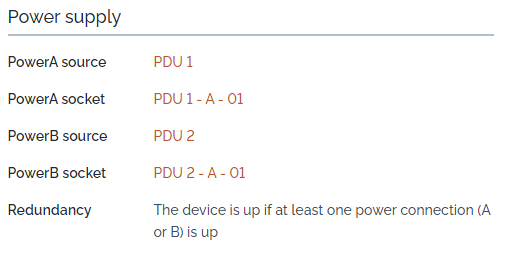
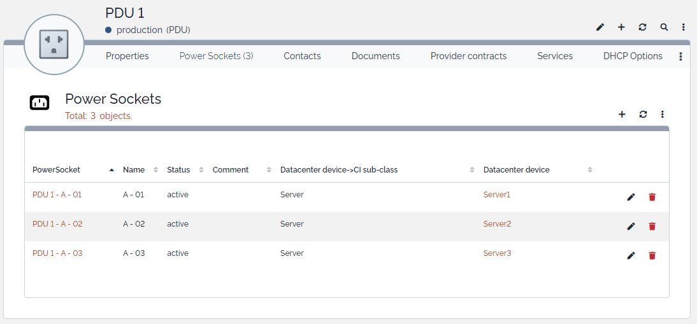

# iTop-br-powersocket

Copyright (c) 2021-2025 Björn Rudner

## What?

Add power sockets to PDUs

### Power Supply

### PDU

## iTop Compatibility

The branch [2.7](https://github.com/rudnerbjoern/iTop-br-powersocket/tree/itop/2.7) is compatible to iTop 2.7 and iTop 3.1.

The branch [main](https://github.com/rudnerbjoern/iTop-br-powersocket/tree/main) will only be compatible to iTop 3.2.

Versions starting with 2.7.x are kept compatible to iTop 2.7

The extension was tested on iTop 2.7.10 and 3.2.1

## Attribution

This Extension uses Icons from:

 by Arthur Shlain from <https://thenounproject.com/browse/icons/term/power-connector/>
