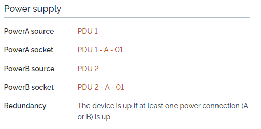
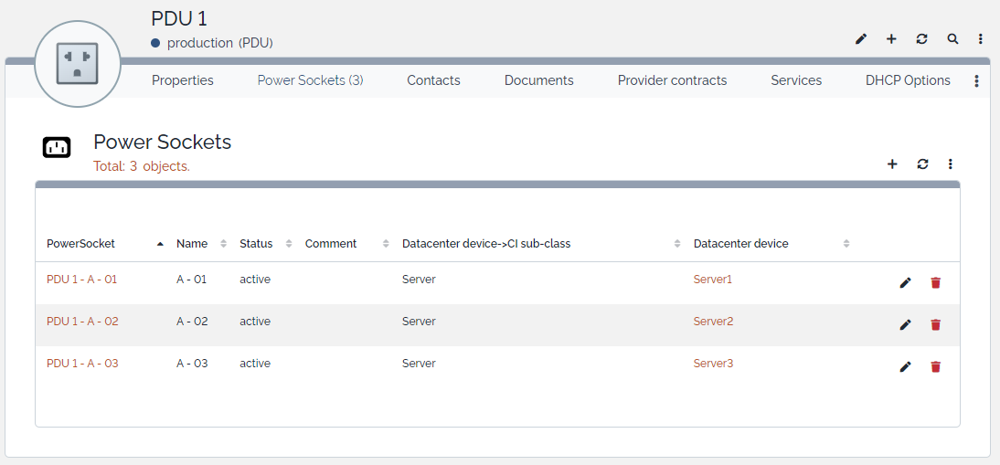

# iTop-br-powersocket

Copyright (c) 2021-2026 Björn Rudner

## Status

> [!WARNING]
> This project is no longer maintained as a standalone extension.
>
> The functionality of `iTop-br-powersocket` has been integrated into [`iTop-br-power-infrastructure`](https://github.com/rudnerbjoern/iTop-br-power-infrastructure) starting with version `1.0.0`.
>
> Please use `iTop-br-power-infrastructure` for all new installations and future updates.

## Migration

If you are currently using `iTop-br-powersocket`, please plan to migrate to:

- [`iTop-br-power-infrastructure`](https://github.com/rudnerbjoern/iTop-br-power-infrastructure)

The integrated module now provides the former PowerSocket functionality together with additional power infrastructure capabilities such as:

- generic power infrastructure extensions
- UPS support
- UPS battery support
- PDU-related power socket handling
- consolidated power infrastructure modeling in a single extension

## Upgrade to iTop-br-power-infrastructure

The functionality of `iTop-br-powersocket` has been integrated into [`iTop-br-power-infrastructure`](https://github.com/rudnerbjoern/iTop-br-power-infrastructure) starting with version `1.0.0`.

### Upgrade path

1. Install version [`1.0.0`](https://github.com/rudnerbjoern/iTop-br-power-infrastructure/releases/tag/v1.0.0) of `iTop-br-power-infrastructure`.
2. Remove the old extension directory from your `extensions` folder:

   `extensions/iTop-br-powersocket`

3. Make sure the new extension directory is present:

   `extensions/iTop-br-power-infrastructure`

4. Run the iTop setup or upgrade process.

### Important notes

- Existing data from `iTop-br-powersocket` will remain available after the migration.
- Do not upgrade directly to a version newer than `1.0.0` when migrating from `iTop-br-powersocket`.
- Always install `iTop-br-power-infrastructure` version `1.0.0` first, then continue with later updates.

### Download

Version `1.0.0` is available here:

- [`iTop-br-power-infrastructure v1.0.0`](https://github.com/rudnerbjoern/iTop-br-power-infrastructure/releases/tag/v1.0.0)

## Former Scope of This Project

This extension added the concept of individual power sockets to PDUs in iTop and allowed `DatacenterDevice` objects to be connected to specific PDU sockets.

It introduced the class `PowerSocket` and provided automatic synchronization logic between:

- `PowerSocket`
- `PDU`
- `DatacenterDevice`

Each `DatacenterDevice` could be connected to:

- one Power A socket
- one Power B socket

The extension ensured that:

- no more than two sockets were assigned to a single `DatacenterDevice`
- slots were automatically assigned (A first, then B)
- connections stayed consistent when objects were updated or deleted
- invalid assignments were rejected or rolled back

## Features

The original standalone extension provided:

- a dedicated `PowerSocket` class
- a socket list on `PDU`
- automatic batch creation of power sockets for PDUs
- Power A / Power B socket fields on `DatacenterDevice`
- automatic slot assignment (A → B)
- consistency checks and rollback logic
- event-driven synchronization logic
- PHP 8.2+ compatibility
- multilingual support based on dictionaries

## Screenshots

### Power Supply

### PDU

## Historical Notes

This repository is kept for historical reference and existing users of the standalone module.

No further feature development is planned here.

Future development will continue in:

- [`iTop-br-power-infrastructure`](https://github.com/rudnerbjoern/iTop-br-power-infrastructure)

## iTop Compatibility

Historical compatibility of this standalone extension:

- branch [`2.7`](https://github.com/rudnerbjoern/iTop-br-powersocket/tree/itop/2.7) was compatible with iTop 2.7 and iTop 3.1
- branch [`main`](https://github.com/rudnerbjoern/iTop-br-powersocket/tree/main) targeted iTop 3.2

The standalone extension was tested on:

- iTop `2.7.10`
- iTop `3.2.1`

## Attribution

This extension uses icons from:

 by Arthur Shlain from <https://thenounproject.com/browse/icons/term/power-connector/>
